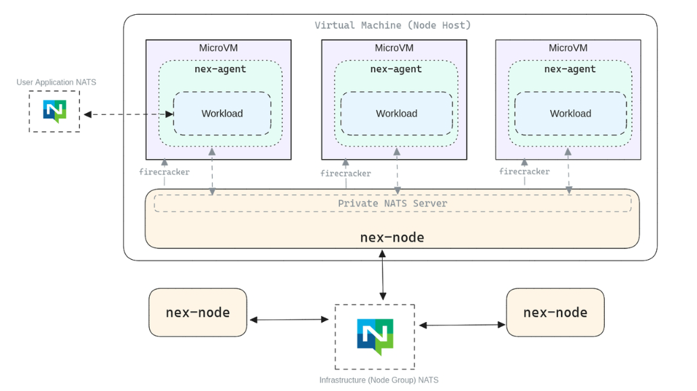

  <h1 align="center">NATS 云原生消息系统</h1>
  

    <a href="README.md"><strong>English</strong></a> | <strong>简体中文</strong>
  

## 目录

- [仓库简介](#项目介绍)
- [前置条件](#前置条件)
- [镜像说明](#镜像说明)
- [获取帮助](#获取帮助)
- [如何贡献](#如何贡献)

## 项目介绍
‌[NATS‌](https://github.com/nats-io/nats-server) NATS 是一个开源、轻量级、高性能的云原生消息系统，由 Synadia 开发并维护。它专为现代分布式系统设计，提供简单的 API 和极低的延迟，适用于微服务、IoT、边缘计算和实时消息传递等场景。NATS 也是 CNCF（云原生计算基金会） 的孵化项目。

**核心特性：**
1. 高性能消息传递：NATS采用纯文本协议（或二进制协议优化版本），支持每秒数百万级消息吞吐，延迟低至微秒级。单服务器可处理12-15MB/s消息流量，集群模式下性能线性扩展。
2. 轻量级架构：无外部依赖，单个二进制文件即可运行，内存占用极低（通常<20MB）。支持容器化部署，适合边缘计算和资源受限环境。
3. 多通信模式：发布/订阅（Pub-Sub）：一对多广播，支持主题（Subject）层级（如orders.>``orders.europe.*）。请求/响应（Request-Reply）：基于临时主题实现同步通信，类似RPC。队列订阅（Queue Groups）：多订阅者共享负载，自动消息分发（竞争消费者模式）。
4. 持久化与流式处理（JetStream）：提供消息持久化、至少一次/精确一次投递、流式处理（Stream）和消费者（Consumer）管理。支持消息重放、TTL、存储限额策略（内存/磁盘）。
5. 动态扩展与集群化：支持自动网状集群（Gossip协议），节点可动态加入/退出。数据分片通过主题路由，无中心瓶颈，适合横向扩展。
6. 安全性控制：基于TLS/SSL的传输加密。多租户支持（账户隔离）。细粒度权限控制（通过NKEY或JWT定义用户/角色权限）。
7. 多语言与协议兼容：提供Go、Java、Python等30+官方客户端，支持WebSocket、HTTP/2协议。兼容云原生生态（如Kubernetes、Prometheus监控集成）。
8. 无代理架构（NATS 2.0+）：通过超级集群（Supercluster）实现跨区域通信，无需额外代理网关，支持混合云部署。
9. 简单灵活的主题路由：通配符主题（*匹配单级，>匹配多级）实现灵活消息路由，无需预配置交换器或队列。
10. 实时监控与管理：内置nats-server --monitoring提供Prometheus指标端点，支持可视化监控（如NATS Surveyor工具）。

本项目提供的开源镜像商品 [**`NATS-云原生消息系统`**](https://marketplace.huaweicloud.com/hidden/contents/f458f8c6-818f-4b3e-8e10-992f49e09f1e#productid=OFFI1141938411671859200)，已预先安装 NATS 软件及其相关运行环境，并提供部署模板。快来参照使用指南，轻松开启“开箱即用”的高效体验吧。

**架构设计：**

> **系统要求如下：**
> - CPU: 4vCPUs 或更高
> - RAM: 16GB 或更大
> - Disk: 至少 50GB

## 前置条件
[注册华为账号并开通华为云](https://support.huaweicloud.com/usermanual-account/account_id_001.html)

## 镜像说明

| 镜像规格                     | 特性说明 | 备注 |
|--------------------------| --- | --- |
| [NATS2.10.20-arm-v1.0](https://github.com/HuaweiCloudDeveloper/nats-image/tree/NATS2.10.20-arm-v1.0?tab=readme-ov-file) | 基于鲲鹏服务器 + Huawei Cloud EulerOS 2.0 64bit 安装部署 |  |

## 获取帮助
- 更多问题可通过 [issue](https://github.com/HuaweiCloudDeveloper/nats-image/issues) 或 华为云云商店指定商品的服务支持 与我们取得联系
- 其他开源镜像可看 [open-source-image-repos](https://github.com/HuaweiCloudDeveloper/open-source-image-repos)

## 如何贡献
- Fork 此存储库并提交合并请求
- 基于您的开源镜像信息同步更新 README.md