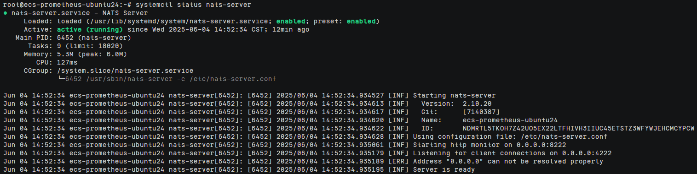
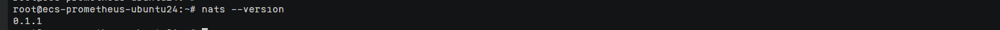
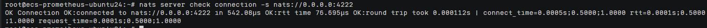
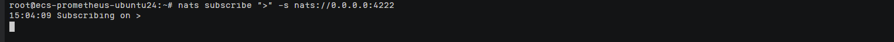
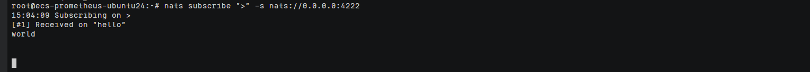

# NATS 使用指南

# 商品链接

[NATS-云原生消息系统]()

# 商品说明

‌NATS 是一个开源、轻量级、高性能的云原生消息系统，由 Synadia 开发并维护。它专为现代分布式系统设计，提供简单的 API 和极低的延迟，适用于微服务、IoT、边缘计算和实时消息传递等场景。NATS 也是 CNCF（云原生计算基金会） 的孵化项目。

# 商品购买

您可以在云商店搜索 **nats**。

其中，地域、规格、推荐配置使用默认，购买方式根据您的需求选择按需/按月/按年，短期使用推荐按需，长期使用推荐按月/按年，确认配置后点击“立即购买”。

# 商品资源配置

商品支持 **ECS 控制台配置**，下面对资源配置的方式进行介绍。

## ECS 控制台配置

### 准备工作

在使用ECS控制台配置前，需要您提前配置好 **安全组规则**。

> **安全组规则的配置如下：**
> - 入方向规则放通端口 `2379`、`3000`、`4000`，**源地址内必须包含您的客户端 ip**，否则无法访问
> - 入方向规则放通 CloudShell 连接实例使用的端口 `22`，以便在控制台登录调试
> - 出方向规则一键放通

### 创建ECS

前提工作准备好后，选择 ECS 控制台配置跳转到购买 ECS 页面，ECS 资源的配置如下图所示：

> **值得注意的是：**
> - VPC 您可以自行创建
> - 安全组选择 [**准备工作**](#准备工作) 中配置的安全组；
> - 弹性公网IP选择现在购买，推荐选择“按流量计费”，带宽大小可设置为5Mbit/s；
> - 高级配置需要在高级选项支持注入自定义数据，所以登录凭证不能选择“密码”，选择创建后设置；
> - 其余默认或按规则填写即可。

# 商品使用

## NATS 使用

### 查看NATS服务端状态

systemctl status nats-server

### 查看NATS客户端版本

nats --version

### 检查与服务器的连接

nats server check connection -s nats://0.0.0.0:4222

### 启动一个订阅者

nats subscribe ">" -s nats://0.0.0.0:4222

### 发布信息

nats pub hello world -s nats://0.0.0.0:4222

### 接收信息

### 参考文档

[NATS官网](https://nats.io/)